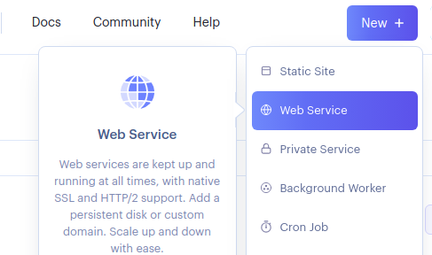
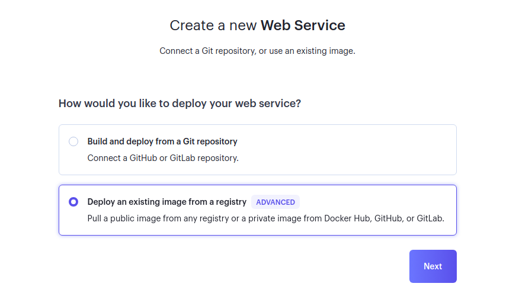
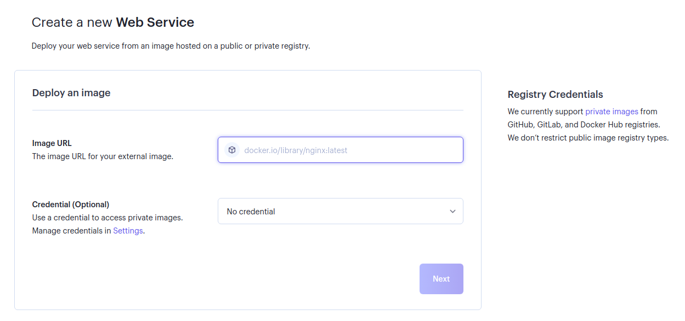
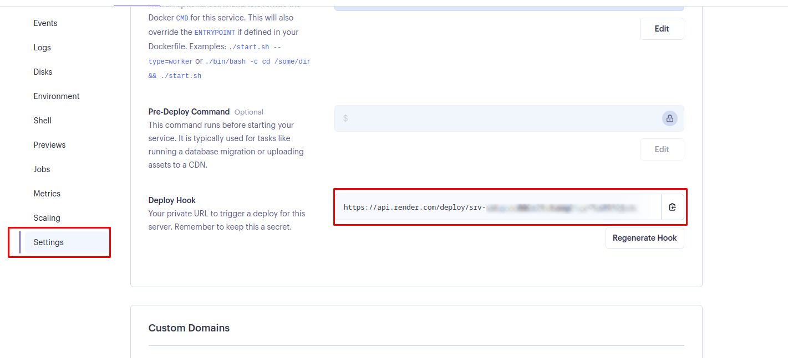
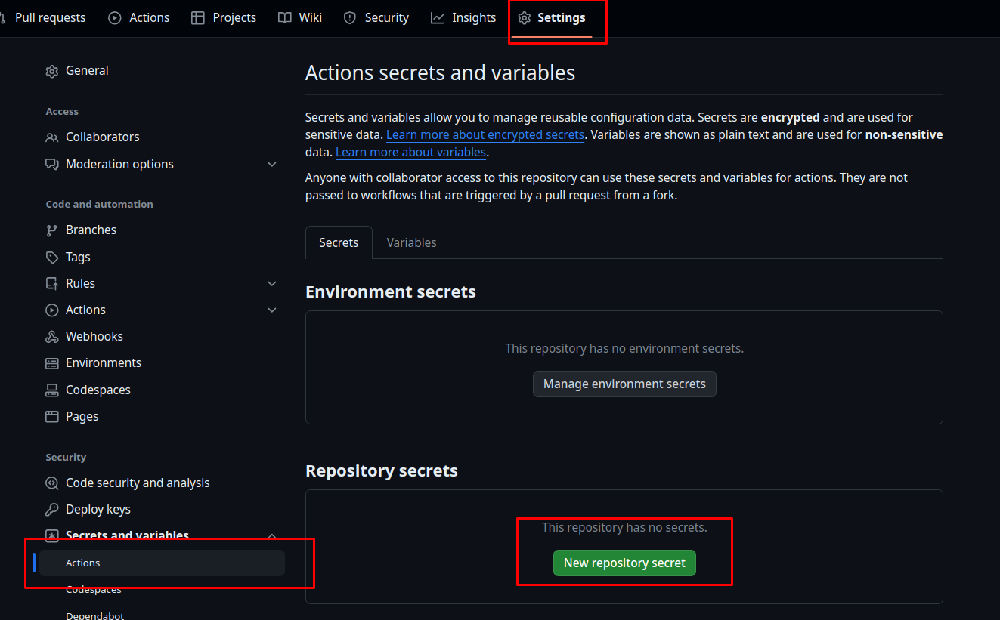
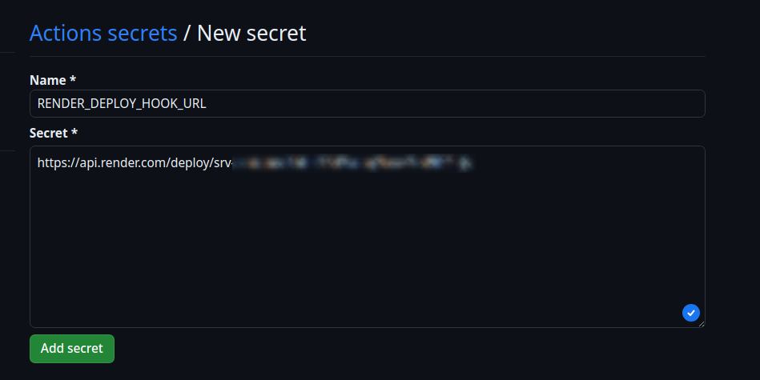

# Comment déployer sur render.com via Github Action

## Créez un nouveau dépôt sur Github

Lors de la création de votre projet sur Github, vous devez respecter la structure suivante pour votre projet:

```
votre_projet/
    | - .github/
    |   | - workflows/      # Dossier contenant les actions Github
    |   |   | - build.yaml   # Fichier de configuration de l'action Github
    | - backend/           # Dossier contenant le code backend
    |   | * Votre code backend *
    | - docker/           # Dossier contenant les fichiers de configuration
                          # à intégrer dans docker
    |   | - nginx.conf          # Fichier de configuration de nginx
    |   | - supervisord.conf    # Fichier de configuration de supervisord
    | - frontend/         # Dossier contenant le code frontend
    |   | * Votre code frontend Angular *
    | - .dockerignore   # Fichier contenant les fichiers à ignorer lors du build
    | - Dockerfile      # Fichier de configuration de docker
```

Vous devrez copier les fichiers suivants dans votre projet pour pouvoir déployer sur render.com:

- [.github/workflows/build.yaml](./.github/workflows/build.yaml)
- [Dockerfile](./Dockerfile)
- [.dockerignore](./.dockerignore)
- [docker/nginx.conf](./docker/nginx.conf)
- [docker/supervisord.conf](./docker/supervisord.conf)

Vous devrez également modifier le fichier `Dockerfile` pour qu'il corresponde à votre projet :

Sur la ligne :

```dockerfile
# Copy projects
COPY --from=builder-frontend /app/dist/projet-angular/browser/ /var/www/html
```

Vous devez remplacer `projet-angular` par le nom de votre projet Angular (le champ `name` dans le fichier `package.json`, avec des `_` au lieu des `-`).

Dans le fichier `.github/workflows/build.yaml`, changez la variable `env.IMAGE_NAME` en `<nom_github>/tp_<nom>_<prenom>` (par exemple `Bricklou/tp_bailleau_louis`). Si vous travaillez dans une organisation github, cela sera `<nom_de_lorganisation>/tp_<nom>_<prenom>`.

Et pour finir, vérifiez que votre branche est bien `main` (ou modifier le fichier `.github/workflows/build.yaml` en conséquence)

## Créez un nouveau dépôt sur render.com

Ensuite, rendez vous sur [render.com](https://dashboard.render.com/) et créez un nouveau dépôt comme suit :




Sur l'écran suivant, vous devrez passer une URL au format `ghcr.io/<nom_github>/tp_<nom>_<prenom>:latest` dans le champ `Image URL`:



À partir de là, render devrait pouvoir déployer votre image tout seul. vous n'aurez plus besoin de la mettre à jour pour les prochains TPs.

## Dire à Github de prévenir Render quand une nouvelle image est disponible

Tout d'abord, aller dans `Settings` > `Deploy hook` :



Vous aller copier ce lien pour l'ajouter à Github.



Collez votre URL dans le secret puis validez.


Et voilà ! Votre projet va pouvoir se déployer sur render.com !

Dès que vous pousserez du code dans la branche `main`, Github va lancer l'action `build.yaml` qui va construire une nouvelle image docker et la pousser sur Github Container Registry. Une fois l'image poussée, Github va envoyer une notification à render.com qui va récupérer l'image et la déployer.

### N.B.: Méthode de travail

Pour bien gérer les déploiements automatiques, je vous recommande de travailler de la manière suivante :

- branche `main`: cela sera votre branche de déploiement, c'est ici que le code final pour vos TP se retrouvera
- branche `tpXX`: cela sera votre branche de travail pour le TP courant (ex. TP02)

Quand un nouveau TP est donné, créez une nouvelle branche `TPXX` (remplacez `XX` par le numéro de TP) et faites vos commit dedans:

```sh
git status
# Votre branche courante devrait être `main`
git switch -c tpXX # remplacez XX
```

Lorsque vous devrez rendre le TP, fusionnez votre branche dans main:

```sh
# Changement de branche vers main
git switch main
# Fusion de la branche de TP dans main
git merge tpXX main
```
