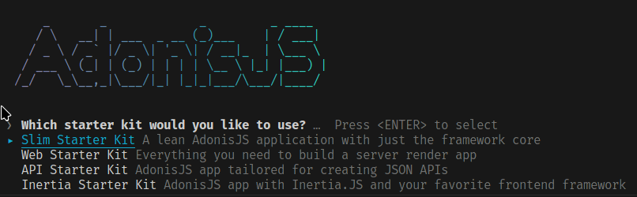
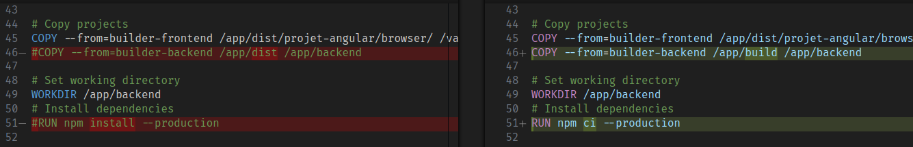
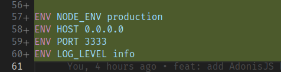
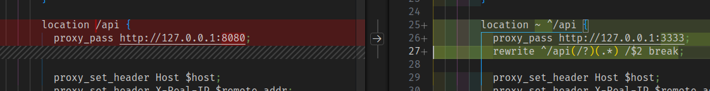
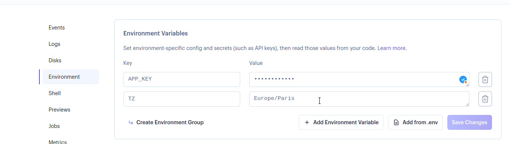

# Mise en place du backend à partir du [premier HOWTO](./HOWTO.md)

## Mise en place du projet

Pour commencer, créez le projet backend. Vous pouvez utiliser la stack que vous souhaitez, pour ma part, je vais utiliser [AdonisJS](https://adonisjs.com) :

```sh
# Il est possible que vous ayez déjà un dossier "backend" de présent,
# supprimez le avant d'effectuer cette commande
npm create adonisjs backend
```

Vous devrez voir le menu suivant apparaitre. Sélectionner l'option comme ci-dessous :



Maintenant, dans le backend, installez le paquet suivants :

```sh
# Ce paquet est utilisé pour la validation des données
# Doc: https://vinejs.dev/docs/introduction
node ace add vinejs
```

## Configuration

### Docker

Dans le fichier `Dockerfile`, vous allez devoir activer l'ajout du backend Adonis. Dans l'ensemble, cela vous n'avez besoin que de décommenter les lignes déjà présente comme suit :



Ajoutez aussi quelques variables d'environnement par défaut :



### Nginx

Dans le fichier `docker/nginx.conf`, changez juste la configuration comme suit :



### supervisord

Dans le fichier `docker/supervisord.conf`, décommentez toute la partie "backend" déjà présente

## Ajout des fichiers manquant

Pour finaliser l'installation, il ne vous manque que quelques fichiers lié au token JWT et le middleware lié.

Ces derniers sont situés dans :

- `backend/app/middlewares/jwt_middleware.ts`
- `backend/app/services/jwt_service.ts`
- `backend/start/kernel.ts`
- `backend/types/request.ts`
- `frontend/src/proxy.conf.json` (modifiez aussi le fichier `angular.json` pour y ajouter `"options": { "proxyConfig": "src/proxy.conf.json" }` dans `build.serve`)

N'oubliez pas d'installer les modules `jsonwebtoken` et `@types/jsonwebtoken` avec NPM.

## Pour finir : on déploie

Pour le déploiement, vous aurez besoin de configurer 2 variables d'environnement pour que serveur AdonisJS puisse fonctionner : `TZ` (pour la timezone) et `APP_KEY` (un secret qui sert pour le JWT et le hash).

Vous pouvez les configurer dans render comme ceci :


(Vous pouvez laisser render générer la valeur pour l'`APP_KEY`, du moment qu'elle fait 16 caractères de long minimum)
